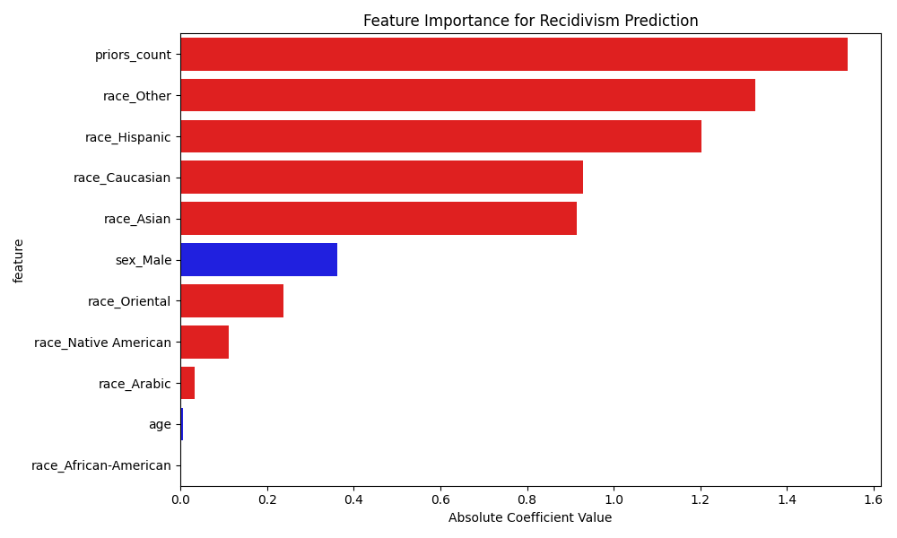

# Algorithmic Bias & Recidivism Risk Audit (COMPAS Analysis)

An empirical data analytics and audit project evaluating algorithmic fairness, systemic disparities, and feature importance across recidivism risk assessment instruments utilizing the ProPublica COMPAS dataset.



# Executive Summary

Predictive scoring algorithms deployed in high-stakes operational and policy decisions frequently inherit or amplify historical sampling disparities. This project presents a structured statistical audit of the **COMPAS (Correctional Offender Management Profiling for Alternative Sanctions)** risk assessment tool. 

By modeling feature coefficients and quantifying prediction disparity, this repository benchmarks how demographic attributes (such as race, age, and gender) systematically bias risk scoring matrices against observed historical outcomes.

# Analytical Objectives & Core Findings

1. **Feature Importance & Coefficient Quantification:**
   * Extracted absolute coefficient values from predictive scoring models to evaluate the weight distribution of prior offenses versus demographic variables.
   * Benchmarked demographic variables against prior conviction counts (`priors_count`) to assess model alignment with objective legal factors.

2. **Demographic Disparity Audit:**
   * Quantified false positive parity (FPR) across demographic subsets to inspect systemic skewness in risk score categorizations.
   * Isolated confounding factors through multivariate statistical modeling to test whether demographic correlations persist after controlling for offense severity and age.

3. **Data Governance & Algorithmic Ethics:**
   * Translated empirical risk distribution gaps into actionable framework recommendations for algorithmic fairness, bias mitigation, and responsible AI deployment.

# Repository Architecture

```text
├── compas-scores-two-years-violent.csv  # Baseline dataset tracking recidivism outcomes
├── Compas Analysis.ipynb                # Exploratory data analysis, survival analysis & disparity modeling
├── bias_analysis.py                     # Automated feature importance extraction & coefficient computation
├── feature_importance.csv               # Structured coefficient weights and ranking matrix
├── feature_importance.png               # Visual breakdown of absolute model coefficients
└── README.md                            # Project overview, methodology & findings
```
# Tech Stack & Methodologies

* **Environment & Analytics:** Python 3.x, Jupyter Notebook
* **Data Engineering & Manipulation:** Pandas, NumPy
* **Statistical Modeling & Inference:** Scikit-Learn, Statsmodels
* **Visual Analytics & Reporting:** Matplotlib, Seaborn

